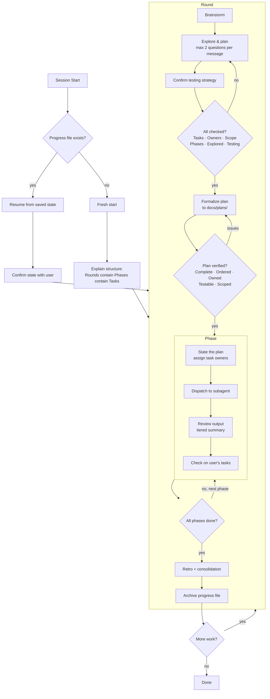

# Pair Programming Rounds

A Claude Code plugin for structured pair programming. Instead of delegating work entirely to Claude, this skill organizes sessions into collaborative **rounds** with explicit task ownership, keeping you in the driver's seat.

## What it does

- **Rounds** — Each round starts with collaborative brainstorming to shape the work
- **Phases** — Work is broken into phases with tasks assigned to you, Claude, or both
- **Retros** — Every round ends with a lightweight retrospective to tune working styles, ownership splits, and pacing
- **Check-ins** — Tiered summaries after each task (status line), at phase boundaries (compact view), and on request (full detail)
- **Advanced brainstorming** — Goes beyond surface-level planning: challenges assumptions, explores edge cases, maps constraints, and identifies risks before any code is written
- **Plan verification** — Every plan is checked against a 5-point checklist (completeness, ordering, ownership clarity, testability, scope match) before execution begins
- **Active engagement** — Claude uses recommend-and-probe patterns, always noting alternatives considered and asking real questions — not "sound good?"
- **Subagent dispatch** — Claude manages the session and dispatches coding work to focused subagents, keeping its context clean for conversation
- **Persistence** — Progress is saved to disk with YAML frontmatter so nothing gets lost between sessions or context compactions
- **Live dashboard** — Optional companion dashboard that watches the progress file and renders a persistent browser view
- **Tufte visualizations** — Self-contained HTML visualizations using pre-built templates for dependency maps, state machines, treemaps, and more
- **Testing** — Defaults to RED-GREEN TDD, confirms testing strategy with you before writing code

## Install

```bash
# Add the marketplace
/plugin marketplace add jah2488/pair-programming-rounds

# Install the plugin
/plugin install pair-programming-rounds
```

### Optional: Live Dashboard

The dashboard watches your progress file and renders a live view in your browser. To use it, you need to run it from the plugin's `tools/` directory (or copy `dashboard.js` and `package.json` somewhere convenient):

```bash
# From the plugin directory:
node tools/dashboard.js /path/to/your/project

# Or if you copied the files:
node dashboard.js /path/to/your/project
```

Then open `http://localhost:3456`. The page auto-refreshes when the progress file changes.

## Usage

Start any session with something like:

- "Let's pair on adding an inventory system"
- "Let's work on refactoring the event handler"
- "I want to build a combat system, let's pair"

Claude will walk you through the structure and start brainstorming.

## Architecture

```
┌─────────────────────────────────────────────────┐
│  Main Skill: pair-programming-rounds             │
│  Role: Session manager + conversation partner    │
│  - Round/phase/task lifecycle                    │
│  - Brainstorming, check-ins, retros             │
│  - Dispatches work to subagents                  │
│  - Writes progress file (YAML frontmatter + MD) │
└──────────┬──────────────┬───────────────────────┘
           │              │
    ┌──────▼──────┐ ┌─────▼──────────┐
    │ Code Worker │ │ Viz Generator  │
    │ (subagent)  │ │ (subagent)     │
    │ - Reads code│ │ - Fills HTML   │
    │ - Writes    │ │   templates    │
    │   impl      │ │ - Writes .html │
    │ - Runs tests│ │                │
    └─────────────┘ └────────────────┘
```

The main skill stays focused on managing the session and conversation. When coding work needs to happen, it dispatches to a subagent that gets a clean context window dedicated to that task. When visualizations are needed, another subagent fills a pre-built HTML template with data.

This means the session manager isn't carrying implementation details in its context, and the coding subagents aren't burdened with session management rules.

## How it works



1. **Brainstorm** — Claude asks focused questions (max 2 per message) to understand the work. You agree on testing strategy and assign task ownership. Claude recommends one approach, notes alternatives. Advanced brainstorming challenges assumptions, explores edge cases, maps constraints, and identifies risks.
2. **Formalize** — Claude writes a formal implementation plan to `docs/plans/`, then runs a verification checklist (completeness, ordering, ownership, testability, scope) before execution begins.
3. **Execute** — Claude dispatches coding tasks to subagents, reviews output, and presents tiered summaries. At each phase boundary, Claude checks on energy and asks an engagement question about the work.
4. **Retro** — Quick retrospective: what worked, what to adjust, preferences to carry forward.
5. **Persist** — Progress saved to `docs/pair-progress.md` with YAML frontmatter. Completed rounds archived to `docs/pair-progress-round-N.md`.

## Progress file format

The progress file uses YAML frontmatter (machine-readable) with a Markdown body (human-readable):

```markdown
---
round: 2
previous_round: docs/pair-progress-round-1.md
status: executing
phase: 2
phase_name: "Build API endpoints"
total_phases: 3
current_task: "Implement GET /users endpoint"
task_owner: claude
plan: docs/plans/2026-03-13-user-api.md
detail_level: moderate
---

# Round 2

## Phases
| # | Phase | Status |
|---|-------|--------|
| 1 | Data models | done |
| 2 | Build API endpoints | in progress |
| 3 | Integration tests | pending |

## Completed Work
- Phase 1: Created User and Session models with migrations

## Open Items
- Consider pagination for /users endpoint

## Testing Strategy
- **Approach:** RED-GREEN TDD
- **Libraries:** pytest, httpx
- **Verification:** run test suite + manual curl against dev server

## Ownership Preferences
- User owns all database migration decisions
- Detail level: moderate
```

The YAML frontmatter enables the companion dashboard and any future tooling to parse session state without scraping Markdown.

### Upgrading from v3

If you have an existing `docs/pair-progress.md` from v3 (without YAML frontmatter), Claude will automatically migrate it on the next session start. It reads the existing sections, generates the YAML frontmatter, and rewrites the file — preserving all your data. Archived round files (`docs/pair-progress-round-N.md`) are left as-is since they're read-only references.

## Tufte Visualizations

The plugin includes 8 pre-built HTML visualization templates following [Edward Tufte's](https://www.edwardtufte.com/tufte/) design principles. Claude fills these templates with data from your codebase rather than generating D3 code from scratch — more reliable, more consistent.

| When you're asking... | Template | What it shows |
|---|---|---|
| "What depends on what?" | Dependency Map | Force-directed graph of module relationships |
| "Where is the complexity?" | Complexity Dashboard | Small-multiple sparklines per file |
| "How does data flow?" | Data Flow Diagram | Layered flow with transformation annotations |
| "What breaks if I change this?" | Change Impact | Dependency tree colored by risk |
| "What are the possible states?" | State Machine | States and transitions with guards |
| "Which approach should we pick?" | Comparative Table | Tufte-style table, sortable, with sidenotes |
| "What happened in what order?" | Timeline | Sequence diagram with proportional time |
| "How big is everything?" | Codebase Treemap | Nested rectangles sized by LOC |

Each visualization is a self-contained HTML file — open it in a browser, no server needed. Titles are questions, captions are answers. Every visualization includes a data table fallback for printing.

## Why this skill?

AI coding assistants are powerful, but the default interaction pattern — "tell the AI what to build, review what it produces" — has real costs.

**Developers who delegate too much understand their code less.** A [METR study (2025)](https://metr.org/blog/2025-07-10-early-2025-ai-experienced-os-dev-study/) found that experienced developers were actually 19% *slower* with AI tools, partly because AI-assisted coding led to more idle time and less cognitive engagement. The [AI deskilling paradox](https://cacm.acm.org/news/the-ai-deskilling-paradox/) (Communications of the ACM) documents how routine AI delegation erodes the skills you need most when things go wrong.

This skill is designed around research from several fields:

- **[Cognitive Load Theory](https://onlinelibrary.wiley.com/doi/abs/10.1207/s15516709cog1202_4)** (Sweller, 1988) — Working memory is limited. The skill reduces extraneous load through chunking, tiered summaries, and the [inverted pyramid](https://www.nngroup.com/articles/inverted-pyramid/) — leading with the most important information.

- **[The generation effect](https://pmc.ncbi.nlm.nih.gov/articles/PMC3556209/)** — You remember things better when you generate them yourself. The skill asks you to articulate architectural reasoning at key decisions.

- **[The testing effect](https://pubmed.ncbi.nlm.nih.gov/16507066/)** (Roediger & Karpicke, 2006) — Retrieving knowledge strengthens retention. Consolidation pauses at round boundaries use this.

- **[The paradox of choice](https://works.swarthmore.edu/fac-psychology/198/)** (Schwartz, 2004) — Too many options leads to paralysis. The recommend-and-probe pattern presents one recommendation with a targeted question.

The goal isn't to slow you down — it's to keep you in the driver's seat on the decisions that matter, so at the end of a session you understand what was built and *why*.

## Design principles

**Reliability over features.** The skill follows ~15 clear behavioral rules rather than ~40 conditional ones. A simpler spec that Claude follows 95% of the time beats a complex one followed 60% of the time.

**Phase boundaries are the rhythm.** Energy check-ins, engagement questions, and progress summaries all happen at phase boundaries — the natural checkpoints in the work. No artificial timers or counting heuristics.

**Orchestrator + workers.** The main skill manages conversation; subagents handle implementation. Neither carries the other's overhead.

**User controls detail level.** Say "more detail" or "less detail" at any time. No auto-detection from implicit signals — just explicit preference.

## Feedback

This is a work in progress! If you try it out, I'd love to hear:

- Did the round/phase/task structure feel natural or rigid?
- Were Claude's check-ins helpful or too verbose?
- Did session resumption work smoothly?
- Did subagent dispatch feel seamless?
- What would you change?

Open an issue or reach out directly.
