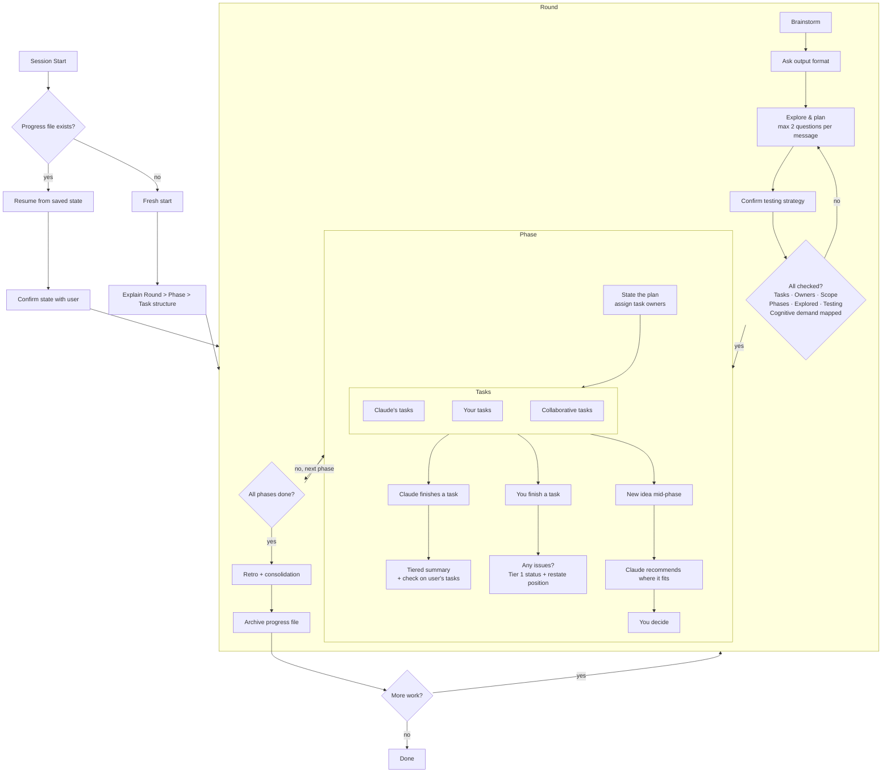

# Pair Programming Rounds

A Claude Code plugin for structured pair programming. Instead of delegating work entirely to Claude, this skill organizes sessions into collaborative **rounds** with explicit task ownership, keeping you in the driver's seat.

## What it does

- **Rounds** — Each round starts with collaborative brainstorming to shape the work
- **Phases** — Work is broken into phases with tasks assigned to you, Claude, or both
- **Retros** — Every round ends with a lightweight retrospective to tune working styles, ownership splits, and pacing
- **Check-ins** — After every piece of work, Claude provides tiered summaries with visual progress dashboards, keeping you informed without overwhelming
- **Active engagement** — Claude keeps you in the architect's seat with recommend-and-probe patterns, devil's advocate moments, and architecture ownership checks — reducing option paralysis without reducing critical thinking
- **Adaptive pacing** — Session energy management with break suggestions at natural boundaries, cognitive demand ordering (analytical → creative → routine), and AI brain fry detection
- **Adaptive detail** — Automatically calibrates explanation depth to your expertise, adjustable anytime with "more detail" or "less detail". Silent observation is treated as agreement — Claude won't reduce detail just because you're quietly reading
- **Persistence** — Progress is saved to disk so nothing gets lost between sessions or context compactions. Rounds are archived individually for clean state management
- **Testing** — Defaults to RED-GREEN TDD, confirms testing strategy with you before writing code

## Install

```bash
# Add the marketplace
/plugin marketplace add jah2488/pair-programming-rounds

# Install the plugin
/plugin install pair-programming-rounds
```

## Usage

Start any session with something like:

- "Let's pair on adding an inventory system"
- "Let's work on refactoring the event handler"
- "I want to build a combat system, let's pair"

Claude will walk you through the structure and start brainstorming.

## How it works



1. **Brainstorm** — Claude asks focused questions (max 2 per message) to understand the work. You decide output format (Markdown or HTML), agree on testing strategy, and assign task ownership. Claude recommends one approach and mentions alternatives considered.
2. **Execute** — Work phases in order, tasks ordered by cognitive demand. Claude summarizes its work with tiered output, explains *why* it made decisions, and checks on your progress.
3. **Retro** — Quick retrospective at round end: what worked, what to adjust, ownership preferences to carry forward, and an energy check.
4. **Persist** — Progress is saved to `docs/pair-progress.md` in your project. Completed rounds are archived to `docs/pair-progress-round-N.md`. Pick up right where you left off.

## Why this skill?

AI coding assistants are powerful, but the default interaction pattern — "tell the AI what to build, review what it produces" — has real costs.

**Developers who delegate too much understand their code less.** A [METR study (2025)](https://metr.org/blog/2025-07-10-early-2025-ai-experienced-os-dev-study/) found that experienced developers were actually 19% *slower* with AI tools, partly because AI-assisted coding led to more idle time and less cognitive engagement. The [AI deskilling paradox](https://cacm.acm.org/news/the-ai-deskilling-paradox/) (Communications of the ACM) documents how routine AI delegation erodes the skills you need most when things go wrong — debugging, architectural reasoning, and diagnosis.

**AI fatigue is real.** Long sessions with AI assistants produce a specific kind of exhaustion: you stop reading carefully, approve things you shouldn't, and lose track of what the code actually does. This isn't laziness — it's the natural result of sustained high-cognitive-load interaction without structure.

This skill is designed around research from several fields to counteract these problems:

- **[Cognitive Load Theory](https://onlinelibrary.wiley.com/doi/abs/10.1207/s15516709cog1202_4)** (Sweller, 1988) — Working memory is limited. The skill reduces extraneous load through chunking, tiered summaries, and the [inverted pyramid](https://www.nngroup.com/articles/inverted-pyramid/) (Nielsen Norman Group) — always leading with the most important information so you can stop reading when you have what you need.

- **[The generation effect](https://pmc.ncbi.nlm.nih.gov/articles/PMC3556209/)** — You remember things better when you generate them yourself than when you passively read them. This is why the skill asks you to articulate architectural reasoning at key decisions, rather than just approving Claude's recommendation.

- **[The testing effect](https://pubmed.ncbi.nlm.nih.gov/16507066/)** (Roediger & Karpicke, 2006) — Retrieving knowledge from memory strengthens retention more than re-studying. The skill's consolidation pauses ("summarize what we just built in one sentence") use this to help lock in understanding at round boundaries.

- **[The paradox of choice](https://works.swarthmore.edu/fac-psychology/198/)** (Schwartz, 2004) — Too many options leads to decision paralysis. The skill's recommend-and-probe pattern presents one recommendation with a targeted question, mentioning alternatives exist without laying them all out unless asked.

The goal isn't to slow you down or add ceremony — it's to keep you in the driver's seat on the decisions that matter, while letting Claude handle the work that doesn't require your judgment. The structure exists so that at the end of a session, you understand what was built and *why*, not just that it passes tests.

## Feedback

This is a work in progress! If you try it out, I'd love to hear:

- Did the round/phase/task structure feel natural or rigid?
- Were Claude's check-ins helpful or too verbose?
- Did session resumption work smoothly?
- Did the active engagement (probes, devil's advocate, ownership checks) feel natural or forced?
- What would you change?

Open an issue or reach out directly.
