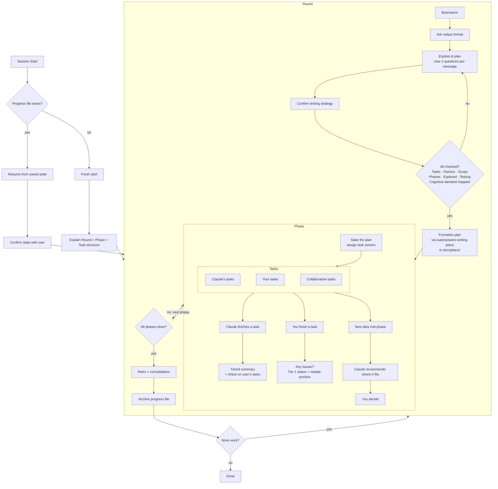

# Pair Programming Rounds

A Claude Code plugin for structured pair programming. Instead of delegating work entirely to Claude, this skill organizes sessions into collaborative **rounds** with explicit task ownership, keeping you in the driver's seat.

## What it does

- **Rounds** — Each round starts with collaborative brainstorming to shape the work
- **Phases** — Work is broken into phases with tasks assigned to you, Claude, or both
- **Retros** — Every round ends with a lightweight retrospective to tune working styles, ownership splits, and pacing
- **Check-ins** — After every piece of work, Claude provides tiered summaries with visual progress dashboards, keeping you informed without overwhelming
- **Active engagement** — Claude keeps you in the architect's seat with recommend-and-probe patterns, devil's advocate moments, and architecture ownership checks — reducing option paralysis without reducing critical thinking
- **Adaptive pacing** — Session energy management with break suggestions at natural boundaries, cognitive demand ordering (analytical → creative → routine), and AI brain fry detection
- **Adaptive detail** — Automatically calibrates explanation depth to your expertise, adjustable anytime with "more detail" or "less detail". Silent observation is treated as agreement — Claude won't reduce detail just because you're quietly reading
- **Persistence** — Progress is saved to disk so nothing gets lost between sessions or context compactions. Rounds are archived individually for clean state management
- **Testing** — Defaults to RED-GREEN TDD, confirms testing strategy with you before writing code

## Install

```bash
# Add the marketplace
/plugin marketplace add jah2488/pair-programming-rounds

# Install the plugin
/plugin install pair-programming-rounds
```

## Usage

Start any session with something like:

- "Let's pair on adding an inventory system"
- "Let's work on refactoring the event handler"
- "I want to build a combat system, let's pair"

Claude will walk you through the structure and start brainstorming.

## How it works



1. **Brainstorm** — Claude asks focused questions (max 2 per message) to understand the work. You decide output format (Markdown or HTML), agree on testing strategy, and assign task ownership. Claude recommends one approach and mentions alternatives considered.
2. **Formalize** — Once brainstorming is complete, Claude uses the `superpowers:writing-plans` skill to create a formal implementation plan in `docs/plans/`. Every round gets a written plan — no ad-hoc planning.
3. **Execute** — Work phases in order, tasks ordered by cognitive demand. Claude summarizes its work with tiered output, explains *why* it made decisions, and checks on your progress.
4. **Retro** — Quick retrospective at round end: what worked, what to adjust, ownership preferences to carry forward, and an energy check.
5. **Persist** — Progress is saved to `docs/pair-progress.md` in your project. Completed rounds are archived to `docs/pair-progress-round-N.md`. Pick up right where you left off.

## Why this skill?

AI coding assistants are powerful, but the default interaction pattern — "tell the AI what to build, review what it produces" — has real costs.

**Developers who delegate too much understand their code less.** A [METR study (2025)](https://metr.org/blog/2025-07-10-early-2025-ai-experienced-os-dev-study/) found that experienced developers were actually 19% *slower* with AI tools, partly because AI-assisted coding led to more idle time and less cognitive engagement. The [AI deskilling paradox](https://cacm.acm.org/news/the-ai-deskilling-paradox/) (Communications of the ACM) documents how routine AI delegation erodes the skills you need most when things go wrong — debugging, architectural reasoning, and diagnosis.

**AI fatigue is real.** Long sessions with AI assistants produce a specific kind of exhaustion: you stop reading carefully, approve things you shouldn't, and lose track of what the code actually does. This isn't laziness — it's the natural result of sustained high-cognitive-load interaction without structure.

This skill is designed around research from several fields to counteract these problems:

- **[Cognitive Load Theory](https://onlinelibrary.wiley.com/doi/abs/10.1207/s15516709cog1202_4)** (Sweller, 1988) — Working memory is limited. The skill reduces extraneous load through chunking, tiered summaries, and the [inverted pyramid](https://www.nngroup.com/articles/inverted-pyramid/) (Nielsen Norman Group) — always leading with the most important information so you can stop reading when you have what you need.

- **[The generation effect](https://pmc.ncbi.nlm.nih.gov/articles/PMC3556209/)** — You remember things better when you generate them yourself than when you passively read them. This is why the skill asks you to articulate architectural reasoning at key decisions, rather than just approving Claude's recommendation.

- **[The testing effect](https://pubmed.ncbi.nlm.nih.gov/16507066/)** (Roediger & Karpicke, 2006) — Retrieving knowledge from memory strengthens retention more than re-studying. The skill's consolidation pauses ("summarize what we just built in one sentence") use this to help lock in understanding at round boundaries.

- **[The paradox of choice](https://works.swarthmore.edu/fac-psychology/198/)** (Schwartz, 2004) — Too many options leads to decision paralysis. The skill's recommend-and-probe pattern presents one recommendation with a targeted question, mentioning alternatives exist without laying them all out unless asked.

The goal isn't to slow you down or add ceremony — it's to keep you in the driver's seat on the decisions that matter, while letting Claude handle the work that doesn't require your judgment. The structure exists so that at the end of a session, you understand what was built and *why*, not just that it passes tests.

## Tufte Visualizations

The plugin includes a visualization subskill that generates self-contained HTML files following [Edward Tufte's](https://www.edwardtufte.com/tufte/) design principles. These aren't decorative — they're thinking tools that help you reason about your system during pair programming sessions.

### Why Tufte?

Most auto-generated diagrams are noisy. Gradient-filled boxes, decorative icons, rainbow color schemes — visual elements that look busy but don't help you think. Tufte's principles solve this by demanding that every pixel earn its place:

- **Data-ink ratio** — maximize the share of visual elements that convey information. No drop shadows, no 3D effects, no chartjunk
- **Small multiples** — compare things by repeating the same visualization with consistent scales, not by cramming everything into one chart
- **Micro/macro readings** — the overview shows the pattern at a glance; hover/click reveals specifics without leaving the page
- **Integrated evidence** — annotations live next to the data they describe, not in separate panels or hidden behind clicks

The result is visualizations that are dense with information but easy to read — you see the pattern first, then drill into details on demand.

### What gets generated

Every visualization is a single `.html` file with embedded data. No build step, no server, no dependencies to install — just open it in a browser. The files use [Tufte CSS](https://edwardtufte.github.io/tufte-css/) for typography and [D3.js](https://d3js.org/) for data-driven graphics.

The subskill includes 8 visualization types, each mapped to a specific programming question:

| When you're asking... | Visualization | What it shows |
|---|---|---|
| "What depends on what?" | Dependency Map | Force-directed graph of module relationships; hover reveals imports/exports |
| "Where is the complexity?" | Complexity Dashboard | Small-multiple sparklines per file, arranged by directory |
| "How does data flow?" | Data Flow Diagram | Layered flow with transformation annotations on edges |
| "What breaks if I change this?" | Change Impact | Dependency tree colored by risk (coupling × test coverage gap) |
| "What are the possible states?" | State Machine | States and transitions with guards; happy path emphasized |
| "Which approach should we pick?" | Comparative Table | Tufte-style table — no vertical rules, sortable, sidenotes |
| "What happened in what order?" | Timeline | Sequence diagram with proportional time; idle periods compressed |
| "How big is everything?" | Codebase Treemap | Nested rectangles sized by LOC, colored by chosen metric |

### Example: Dependency Map

A dependency map for a game engine might render like this — a force-directed graph where node size encodes the number of dependents and edges show import relationships:

```
                         ┌─────────┐
                    ╶╶╶╶╶│ physics │╶╶╶╶╶╶╶╶╶╶╶╶╶╶╮
                   ╷     └─────────┘               ╷
                   ╷          ╷                     ╷
              ┌─────────┐    ╷               ┌───────────┐
         ╶╶╶╶╶│  render │╶╶╶╶╶╶╶╶╶╶╶╮       │   audio   │
        ╷     └─────────┘    ╷       ╷       └───────────┘
        ╷          ╷         ╷       ╷              ╷
        ╷     ┌─────────┐   ╷  ┌─────────┐         ╷
        ╷     │  scene  │╶╶╶╶╶╶│  input  │         ╷
        ╷     └─────────┘      └─────────┘         ╷
        ╷          ╷                ╷               ╷
        ╷          ╷    ┌───────┐   ╷               ╷
        ╰╶╶╶╶╶╶╶╶╶╶╶╶╶╶│ core  │╶╶╶╶╶╶╶╶╶╶╶╶╶╶╶╶╶╯
                        └───────┘
                     16 dependents

  Hover any node → see its imports, exports, and coupling score
  Click to freeze → compare two modules side by side
```

In the actual HTML output, this is an interactive SVG: nodes are draggable, hovering reveals a detail panel in the margin showing exact imports/exports, and edge thickness encodes the number of shared symbols.

### Example: Complexity Dashboard (Small Multiples)

For a codebase with 12 modules, the dashboard shows one sparkline per file — no axes, no labels on individual charts. The pattern is the message:

```
  auth/login.ts    ▁▂▃▅▇█▇▅▃▂▁▂▃▅▇    auth/session.ts  ▁▁▁▂▂▂▃▃▂▂▁▁▁▁▁▁
  auth/oauth.ts    ▁▁▂▅█████████▇▅▃    auth/tokens.ts   ▁▁▁▁▁▁▂▂▂▁▁▁▁▁▁▁

  api/routes.ts    ▁▂▃▃▃▂▂▃▃▃▂▂▁▂▂    api/middleware.ts ▁▁▁▂▃▃▃▃▃▃▂▂▁▁▁▁
  api/validate.ts  ▁▁▂▂▂▂▂▂▂▂▁▁▁▁▁    api/errors.ts    ▁▁▁▁▁▁▁▁▁▁▁▁▁▁▁▁

  db/queries.ts    ▁▂▃▅▅▅▃▃▅▇█▇▅▃▂    db/migrate.ts    ▁▂▃▂▁▁▁▁▂▃▂▁▁▁▁▁
  db/models.ts     ▁▁▂▃▃▃▃▃▃▃▃▂▂▁▁    db/seeds.ts      ▁▁▁▁▁▁▁▁▁▁▁▁▁▁▁▁

  ─────────────────────────────────────────────────────────────────────
  At a glance: auth/oauth.ts and db/queries.ts are complexity hotspots.
  Hover any sparkline for exact cyclomatic complexity values per function.
```

The insight is immediate — two files dominate complexity. In the HTML version, hovering a sparkline reveals per-function breakdowns.

### Example: Comparative Table

When comparing architectural approaches during brainstorming, the table follows Tufte's rules — no vertical rules, minimal horizontal rules, numbers right-aligned:

```
  Approach          Complexity   Coupling   Testability   Migration risk
  ─────────────────────────────────────────────────────────────────────
  Event sourcing           High        Low          High              Low
  Active Record         Medium       High           Low           Medium
  Repository pattern       Low     Medium        Medium              Low

  ─────────────────────────────────────────────────────────────────────
  Event sourcing trades implementation complexity for the lowest coupling
  and easiest migration path. Repository pattern is the simplest to build
  but creates moderate coupling to the data layer.
```

The caption states the insight, not a description. In HTML, columns are sortable and cells expand on hover to show reasoning.

### How it's invoked

The subskill activates in two modes:

**Auto-suggest during brainstorming** — When the discussion involves architecture, dependencies, data flow, or comparing multidimensional tradeoffs, Claude will suggest a specific visualization type and explain why it would help. You can accept, decline, or ask for a different type.

> *"Before we decide on the data layer approach, a dependency map would help us see which modules are most coupled to the current implementation. Want me to generate one?"*

**Explicit during execution** — When you're debugging complex state, planning a multi-file refactor, or need to understand data flow, ask directly:

- *"Visualize the dependencies in the auth module"*
- *"Show me a state diagram for the checkout flow"*
- *"Map out what breaks if we change the User model"*

During execution phases, the subskill won't interrupt your flow with unsolicited offers. It suggests only when you're stuck or explicitly exploring.

### Design thinking

The subskill is opinionated about a few things:

**No pie charts.** Tufte's least favorite chart type — angular comparisons are harder to read than length comparisons. Use a table or bar chart instead.

**No animation unless it encodes data.** Spinning loaders, entrance animations, and bouncing transitions are visual noise. The only permitted motion is opacity transitions on hover states.

**Titles are questions, captions are answers.** A visualization titled "Dependency Map" tells you nothing. One titled "Where does coupling concentrate?" followed by a caption "The auth module accounts for 60% of all cross-module imports" tells you everything.

**Printable.** Following Tufte's print-first philosophy, every visualization includes a data table below the graphic so hover-dependent information is also accessible without interaction.

**Colorblind-safe.** Never uses red/green as the only distinguishing colors. Prefers single-hue sequential palettes for quantitative data, with a maximum of 4-5 distinct colors per visualization.

### Output location

Visualizations are saved to `docs/visualizations/` in your project:

```
docs/
├── pair-progress.md
├── pair-progress-round-1.md
└── visualizations/
    ├── round-1-brainstorm-dependency-map.html
    ├── round-1-brainstorm-approach-comparison.html
    └── round-2-debug-state-machine.html
```

Each visualization is noted in the active progress file so it's easy to find later.

## Feedback

This is a work in progress! If you try it out, I'd love to hear:

- Did the round/phase/task structure feel natural or rigid?
- Were Claude's check-ins helpful or too verbose?
- Did session resumption work smoothly?
- Did the active engagement (probes, devil's advocate, ownership checks) feel natural or forced?
- What would you change?

Open an issue or reach out directly.
