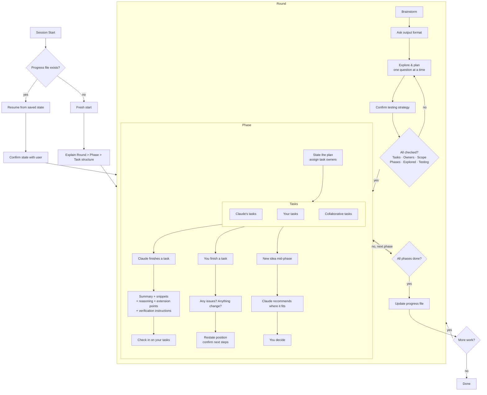

# Pair Programming Rounds

A Claude Code plugin for structured pair programming. Instead of delegating work entirely to Claude, this skill organizes sessions into collaborative **rounds** with explicit task ownership, keeping you in the driver's seat.

## What it does

- **Rounds** — Each round starts with collaborative brainstorming to shape the work
- **Phases** — Work is broken into phases with tasks assigned to you, Claude, or both
- **Check-ins** — After every piece of work, Claude provides tiered summaries with visual progress dashboards, keeping you informed without overwhelming
- **Active engagement** — Claude keeps you in the architect's seat with recommend-and-probe patterns, devil's advocate moments, and architecture ownership checks — reducing option paralysis without reducing critical thinking
- **Adaptive pacing** — Session energy management with break suggestions at natural boundaries, cognitive demand ordering, and AI brain fry detection
- **Adaptive detail** — Automatically calibrates explanation depth to your expertise, adjustable anytime with "more detail" or "less detail"
- **Persistence** — Progress is saved to disk so nothing gets lost between sessions or context compactions
- **Testing** — Defaults to RED-GREEN TDD, confirms testing strategy with you before writing code

## Install

```bash
# Add the marketplace
/plugin marketplace add jah2488/pair-programming-rounds

# Install the plugin
/plugin install pair-programming-rounds
```

## Usage

Start any session with something like:

- "Let's pair on adding an inventory system"
- "Let's work on refactoring the event handler"
- "I want to build a combat system, let's pair"

Claude will walk you through the structure and start brainstorming.

## How it works



1. **Brainstorm** — Claude asks questions one at a time to understand the work. You decide output format (Markdown or HTML), agree on testing strategy, and assign task ownership.
2. **Execute** — Work phases in order. Claude summarizes its work with key snippets, explains *why* it made decisions, shows you where to extend the code, and tells you exactly how to verify correctness.
3. **Persist** — Progress is saved to `docs/pair-progress.md` in your project. Pick up right where you left off in the next session.

## Feedback

This is a work in progress! If you try it out, I'd love to hear:

- Did the round/phase/task structure feel natural or rigid?
- Were Claude's check-ins helpful or too verbose?
- Did session resumption work smoothly?
- What would you change?

Open an issue or reach out directly.
