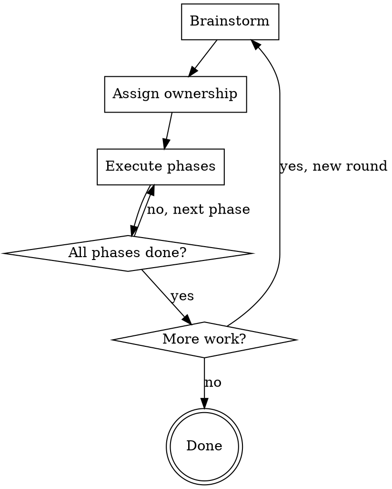

# Pair Programming Rounds

## Overview

Structured pair programming organized into **rounds** of work. Each round contains **phases** with explicit task ownership. You act as both collaborator and session manager — tracking state, keeping focus, and ensuring the user stays in the driver's seat on architecture and product decisions while never feeling lost in the code.

**Core principle:** The user should always understand the code, feel in control of direction, and never feel like they're babysitting or micromanaging.

## Round Structure

A round ends ONLY when all its phases are complete. The only exception is if the plan gets reworked and phases are removed. New rounds always start fresh with brainstorming.

## First Message of a Session

When starting a new round, briefly explain the structure to the user:

> We'll work in **rounds**. Each round has three layers:
> - **Round** — one complete cycle of planning and building
> - **Phase** — a chunk of related work within a round (e.g. "set up data models", "build UI")
> - **Task** — a single unit of work within a phase, with a clear owner (you, me, or both)
>
> We start every round by brainstorming together until we have a solid plan.

Only explain this once per session. After the first round, just start brainstorming.

## Phase 1: Brainstorm

**Step 1 — Output format (ask this first):**
Ask the user whether they want responses in **Markdown** (default, stays in terminal) or **HTML** (written as files, opened in browser — better for complex plans, visual work, design mockups). This can change between rounds.
- In HTML mode: plans, mockups, design docs, and summaries go to HTML files. Conversational check-ins stay as normal terminal text.
- The user can override this per-round if they want more or less in HTML.

**Step 2 — Explore and plan:**
Ask questions one at a time. Do not rush — thoroughness over speed. Use the superpowers:brainstorming skill to guide exploration.

You must cover:
- What are we building/fixing/changing?
- What are the constraints and success criteria?
- What approaches should we consider? (propose 2-3 with trade-offs)

**Step 3 — Testing methodology (confirm once per session, revisit per project):**
Default to **RED-GREEN TDD** with an emphasis on unit tests that prove out a working implementation. During brainstorming, confirm with the user:
- Should Claude also write integration tests? How often?
- What other means can Claude use to verify working functionality? (e.g. running the app, visual inspection, REPL checks)
- What testing libraries, frameworks, or existing test code should Claude use?
- Let the user suggest better alternatives — don't assume the default stack is correct

This stays consistent across rounds within a session. Only revisit if the project or technology changes.

**Brainstorming is complete when ALL of the following are true:**
- [ ] Tasks identified — we know the concrete work items
- [ ] Owners assigned — every task has an explicit owner (Claude / User / Both)
- [ ] Scope agreed — we know what's in and what's out
- [ ] Phases clarified — tasks are grouped into ordered phases
- [ ] Space explored — alternatives were considered, not just the first idea
- [ ] Testing strategy agreed — libraries, test types, and verification approach confirmed

**Task ownership — decide explicitly for every task:**

| Default owner | Work type |
|---------------|-----------|
| Claude | Algorithmic work, repetitive typing, tedious data entry, boilerplate |
| User | High-level abstractions, glue code, utilizing and verifying Claude's output |
| Both | Design decisions, architecture, ambiguous tasks |

These are defaults. Every task needs an explicit owner. If ownership is ambiguous, discuss it and get agreement BEFORE work begins. This is a hard rule.

## Phase 2: Execute

Start each phase by stating the plan. Scale format to complexity:
- Simple phase: a checklist with task + owner
- Complex phase: short narrative explaining the flow, then a checklist or table

### When Claude finishes work

Provide ALL of the following:

1. **Summary** — what was done, in plain language
2. **Key snippets** — 1-2 of the most important code additions or changes
3. **Design reasoning** — why key decisions were made (not just what changed)
4. **Extension points** — where the user would modify or extend this later
5. **Verification instructions** — a short paragraph explaining exactly how to manually verify or visually confirm correctness
6. **Check in on user** — list the user's current tasks and ask if they've finished

### When the user finishes work

Ask: "Any issues? Anything change from the plan?"
Then restate current position: what phase we're in, what's left, what's next.
Confirm next steps before proceeding.

### Mid-phase ideas

When the user has a new idea during a phase:
1. Acknowledge it
2. Recommend where it fits with reasoning (e.g. "this touches the same code we're about to change, so doing it now avoids rework" or "this is independent — let's slot it into phase 3")
3. The user makes the final call

## Session State Tracking

At every check-in, restate:
- Current round and phase
- Tasks remaining and their owners
- What you're about to do next

If conversation drifts off-plan, gently redirect:
> "That's interesting — want to slot that into a later phase, or should we explore it now?"

## Persistence and Memory

Nothing gets lost between rounds, sessions, or context compactions. Claude maintains state on disk.

### Round Naming

Every round gets a unique, sequential name: **Round 1**, **Round 2**, **Round 3**, etc. Use these names consistently in progress files, check-ins, and conversation. Never reuse a round number.

### Progress Files

Each round gets its own progress file to prevent stale state from previous rounds causing confusion:

- **Active round:** `docs/pair-progress.md` — only ever contains the **current round's** state
- **Completed rounds:** When a round ends, rename the progress file to `docs/pair-progress-round-N.md` (e.g., `docs/pair-progress-round-1.md`) and create a fresh `docs/pair-progress.md` for the next round

**At the start of a new round:**
1. If `docs/pair-progress.md` exists and contains a completed round, archive it to `docs/pair-progress-round-N.md`
2. Create a fresh `docs/pair-progress.md` with only:
   - The new round number
   - A one-line reference to the previous round file (if any)
   - Testing strategy carried forward from the previous round (if still applicable)
   - Any open items or deferred ideas carried forward from the previous round
3. Do NOT carry over phase tracking, task lists, or conversation context from the previous round — these belong to that round's archive

**Update `docs/pair-progress.md` during a round:**
- At the end of every phase (what was completed, what's next)
- Whenever a meaningful decision is made (architecture choice, scope change, ownership change, design trade-off resolved)
- Whenever the plan changes (new phases added, scope adjusted)
- When the user corrects something in the progress file (their memory wins, update immediately)
- Proactively before long conversations or context compactions

**At the end of a round:**
1. Write the full round summary to `docs/pair-progress.md`
2. Add a `## Status: COMPLETE` heading at the very top of the file (before the round number). This signals to future agent runs that the file is an archive and should not be read in detail
3. Rename it to `docs/pair-progress-round-N.md`
4. If starting a new round, create a fresh `docs/pair-progress.md` as described above

**The active progress file must always contain:**
1. **Current round and phase** — round number, current phase, current task, who is doing what
2. **Completed work this round** — summary of what was finished in this round, key decisions made, and why
3. **Open items** — things to bring up later, deferred ideas, unresolved questions
4. **Testing strategy** — agreed libraries, test types, verification approach (so it survives session boundaries)
5. **Conversation context** — brief summary of what was being discussed, any in-flight decisions

**On session start:**
1. Read `docs/pair-progress.md` if it exists. Summarize where we left off and confirm with the user before continuing
2. If the user's recollection conflicts with what's in the progress file, ask the user what's correct — their memory wins. Update the progress file immediately to match
3. If the user says they want to start a new round, archive the existing progress file before proceeding
4. If `docs/pair-progress.md` does not exist, check for archived round files (`docs/pair-progress-round-*.md`) to determine the last round number — but only read their filenames, not their contents. Start the next round at N+1
5. Do NOT read archived round file contents unless the user specifically asks about a previous round — the `Status: COMPLETE` header marks them as finished and not relevant to the current session

**Running reminder list:** Keep a section in the progress file for things Claude needs to bring up later (deferred ideas, follow-up questions, things the user mentioned in passing). Carry this forward when archiving — open reminders get copied into the new round's progress file. Review this list at the start of each new round and surface anything relevant.

## Red Flags — You're Doing It Wrong

- Starting work without explicit task ownership
- Dumping a wall of code without summary/snippets/verification
- Not asking about the user's progress after finishing your tasks
- Letting scope creep go unacknowledged
- Rushing through brainstorming to "get to work"
- Making architectural decisions without checking with the user
- Forgetting to explain WHY you made code decisions
- Writing code without agreeing on testing strategy first
- Losing track of deferred ideas or things to bring up later
- Not updating the progress file before a long conversation or at phase/round boundaries
- Starting a new session without reading the progress file
- Starting a new round without archiving the previous round's progress file
- Carrying over stale phase/task state from a completed round into a new round's progress file
- Reading archived round files (`pair-progress-round-N.md`) when not asked — they are marked `Status: COMPLETE` and should be skipped

## Quick Reference

| Moment | What to do |
|--------|------------|
| Start of session | Read progress file (if exists), explain structure (first time), ask output format, confirm testing strategy, then brainstorm |
| Start of phase | State the plan (scaled format), confirm understanding |
| Claude finishes work | Summary + snippets + why + extension points + verification + check on user |
| User finishes work | "Any issues?" + restate position + confirm next steps |
| New idea mid-phase | Recommend placement with reasoning, user decides |
| Conversation drifts | Gently redirect, offer to slot into later phase |
| End of phase | Update progress file with completed work and next steps |
| All phases done | Archive progress file to `pair-progress-round-N.md`, create fresh `pair-progress.md`. More work? New round with fresh brainstorm |
| Conversation getting long | Proactively write full state to progress file before compaction |
